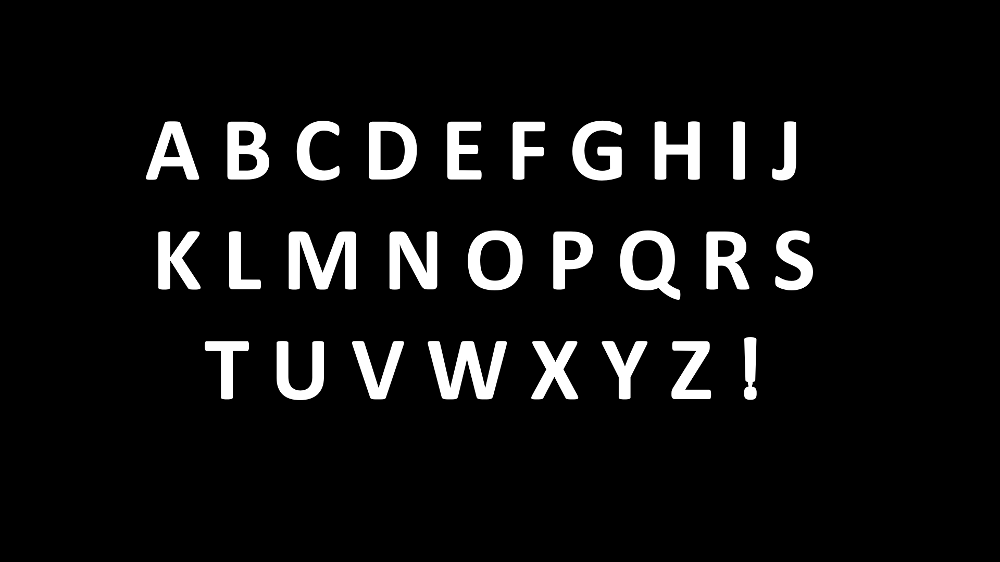
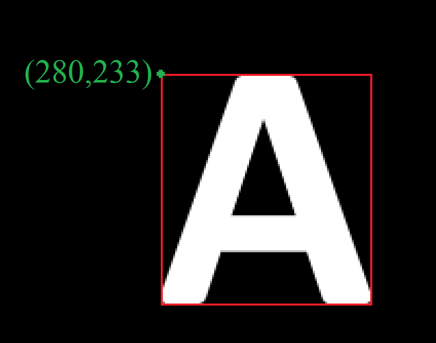
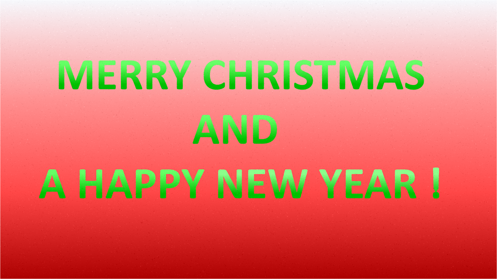
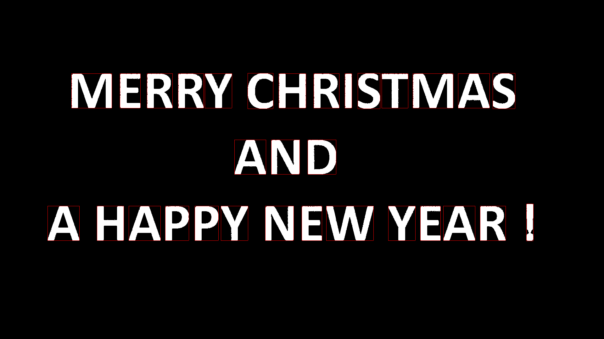
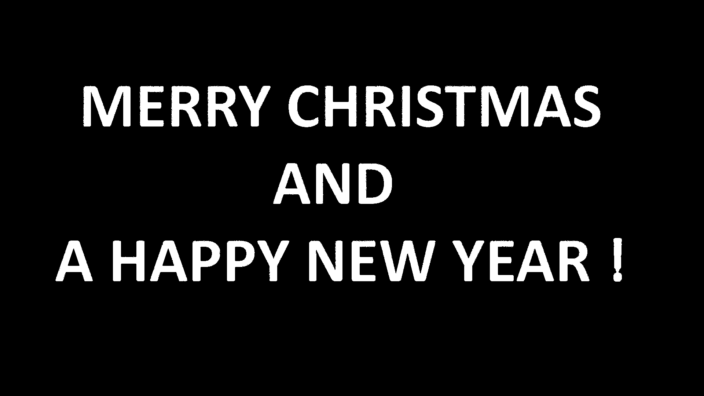

# Mini OCR

This app takes an input image(
)and displayes the text from that image, using:
- a template image containing all the letters and symbols
  

- a file containing the correspondence between the characters and the letters in the template image
>   
    A 280 233
    B 436 233
    C 569 232
    D 707 233
    E 858 233
    F 983 233
    G 1098 231
    H 1256 233
    K 1407 233
    I 304 444
    J 1482 233
    L 440 443
    M 553 444
    N 747 444
    O 897 442
    P 1062 444
    Q 1190 442
    R 1356 444
    S 1488 442
    T 393 655
    U 530 655
    V 675 655
    W 821 655
    X 1019 655
    Y 1154 655
    Z 1289 655
    ! 1428 648

Line format: `character x y` where x, y are the top-left pixel's address

## Steps

- Apply a median filter to remove the noise from the image
  
`Median filter` = sorts the neighboring pixels of the current pixel by intensity and selects the middle one

- Convert the filter image from RGB to HSV
- Segment the image using HUE as a similarity criterion

- Identify the bounding rectangles for individual foreground regions and displaying them

- Identify the words and displaying the message

    `MERRY CHRISTMAS AND A HAPPY NEW YEAR !`